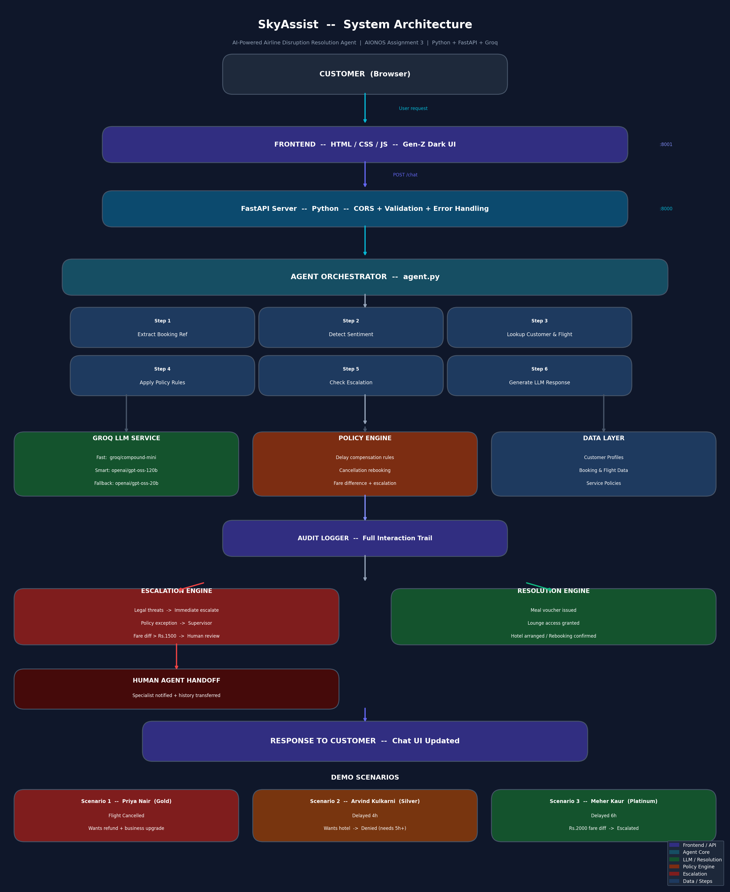

# SkyAssist - AI-Powered Airline Disruption Agent

> AIONOS Agentic AI Factory | Assignment 3 - Customer-Facing Resolution Agent

An intelligent, policy-compliant airline customer support agent that handles flight cancellations and delays in real time and knows exactly when to hand off to a human.

---

## Screenshots

### Architecture Diagram


### Main Chat Interface


### Human Escalation Flow


---

## What It Does

- Understands customer issues from natural language
- Looks up real booking and flight data
- Applies exact airline policies with zero hallucination
- Calculates correct compensation automatically
- Detects angry customers, legal threats, and policy exceptions
- Escalates to a human specialist when needed with full conversation handoff

---

## 3 Live Demo Scenarios

| # | Customer | Tier | Issue | Agent Action |
|---|----------|------|-------|--------------|
| 1 | Priya Nair | Gold | Flight SK-204 cancelled, wants refund + business class upgrade | Offers rebooking OR refund, denies upgrade (beyond policy) |
| 2 | Arvind Kulkarni | Silver | Flight SK-118 delayed 4h, wants hotel | Gives meal voucher + lounge, denies hotel (needs 5h+) |
| 3 | Meher Kaur | Platinum | Flight SK-305 delayed 6h, wants full night hotel + Rs.2000 upgrade | Gives meal + lounge + 6h hotel, escalates fare diff > Rs.1500 |

---

## Tech Stack

| Layer | Technology |
|-------|-----------|
| Backend | Python + FastAPI |
| AI Models | Groq API (groq/compound-mini + openai/gpt-oss-120b) |
| Fallback Model | openai/gpt-oss-20b |
| Frontend | Vanilla JS + HTML/CSS (Gen-Z dark UI) |
| Data | JSON (customers, bookings, policies) |

---

## AI Models Used

```
GROQ_FAST_MODEL  = "groq/compound-mini"      for sentiment, booking ref extraction
GROQ_SMART_MODEL = "openai/gpt-oss-120b"     for reasoning, response generation
GROQ_FALLBACK    = "openai/gpt-oss-20b"      fallback on errors
```

---

## Quick Start

### 1. Clone the repo
```bash
git clone https://github.com/YOUR_USERNAME/skyassist-airline-agent.git
cd skyassist-airline-agent
```

### 2. Add your Groq API key
```bash
cp .env.example .env
# Edit .env and add your GROQ_API_KEY
```

### 3. Install dependencies
```bash
pip install -r backend/requirements.txt
```

### 4. Run the backend
```bash
python backend/main.py
```
Backend starts at: http://localhost:8000

### 5. Open the frontend
Open `frontend/index.html` in your browser directly.

---

## API Endpoints

| Method | Endpoint | Description |
|--------|----------|-------------|
| GET | / | Health check |
| GET | /health | Detailed status |
| POST | /chat | Main chat endpoint |
| GET | /scenarios | List test scenarios |
| GET | /audit-log | View interaction log |
| GET | /docs | Swagger UI |

---

## Policy Rules Enforced

| Situation | Compensation |
|-----------|-------------|
| Delay under 3h | Rs.500 meal voucher |
| Delay 3-5h | Meal voucher + lounge access |
| Delay over 5h | Meal + lounge + hotel (delayed hours only) |
| Flight cancelled | Free rebooking OR full refund |
| Fare diff above Rs.1500 | Requires supervisor approval, escalate |
| Legal threat | Immediate escalation |

---

## Human Handoff Feature

When the conversation gets serious, the agent:
1. Shows a red warning banner at the bottom of the chat
2. Displays a Transfer to Human button
3. On click - animated modal shows a specialist is found
4. Customer confirms - chat locks, full history transferred
5. Human specialist contacts customer within 5 minutes

---

## Project Structure

```
skyassist-airline-agent/
├── backend/
│   ├── main.py            FastAPI server
│   ├── agent.py           Agent orchestration logic
│   ├── groq_service.py    Groq LLM integration
│   ├── policy_engine.py   Airline rules engine
│   ├── models.py          Pydantic data models
│   ├── data.py            Customer, booking, policy data
│   ├── config.py          Configuration
│   └── requirements.txt
├── frontend/
│   ├── index.html         Chat UI
│   ├── style.css          Gen-Z dark theme
│   └── script.js          Frontend logic + handoff
├── docs/
│   └── screenshots/
├── simple_test.py         Quick test script
├── .env.example           API key template
└── README.md
```

---

## Assignment Checklist

- [x] Working agent - handles all 3 scenarios
- [x] Architecture and process flow documented
- [x] Source data only - no invented policies
- [x] AI tools used - Groq (compound-mini + gpt-oss-120b)
- [x] Human escalation with handoff UI
- [x] Audit trail of all interactions
- [x] GitHub repo with one-command local run
- [x] Gen-Z dark UI with scenario buttons
- [x] FastAPI with Swagger docs at /docs

---

Built for AIONOS Agentic AI Factory | Assignment 3 | Bennett University
